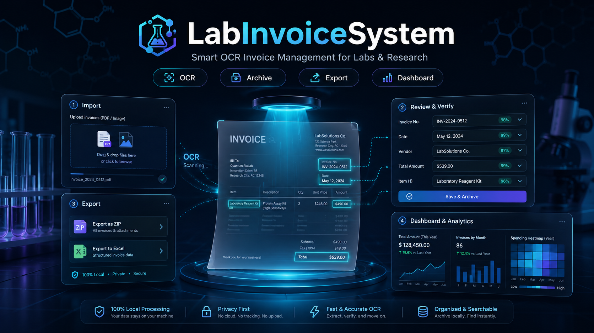
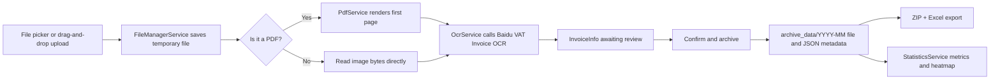

# LabInvoiceSystem

<p align="center">
  
</p>

<p align="center">
  English | <a href="./README.md">简体中文</a>
</p>

[](https://dotnet.microsoft.com/)
[](https://avaloniaui.net/)
[](https://learn.microsoft.com/dotnet/architecture/maui/mvvm)
[](https://www.microsoft.com/windows)
[](https://cloud.baidu.com/product/ocr)
[](./LICENSE)

## Overview

LabInvoiceSystem is a desktop invoice management tool for laboratory, research group, and reimbursement
workflows. It uses Avalonia for the UI and .NET 8 for the application logic, with a workflow centered on
uploading invoices, recognizing them with OCR, reviewing extracted fields, archiving files, exporting
daily reimbursement packages, and reviewing spending statistics.

The current project is primarily tuned for Windows desktop use. Avalonia can run cross-platform, but this
repository's launcher, publish profile, resource paths, and file explorer behavior are Windows-first.

## Core Features

| Area | Capability |
| --- | --- |
| Invoice import | Upload PDF, JPG, JPEG, and PNG invoices through a file picker or drag and drop |
| PDF preview | Render the first PDF page with `PDFtoImage` and `SkiaSharp`; zoom, pan, and reset previews |
| OCR extraction | Extract date, amount, item, invoice number, seller name, and seller tax ID |
| Manual review | Review OCR results and correct date, amount, item name, and payment method before archiving |
| Local archive | Store original invoice files by `YYYY-MM` and write same-name JSON metadata for each invoice |
| Reimbursement export | Export invoices by date as a ZIP package with an Excel detail sheet included |
| Statistics dashboard | Show total amount, invoice count, last-30-days amount, and a one-year spending heatmap |
| API management | Configure, test, and save Baidu OCR API Key and Secret Key from the dashboard |
| Operation log | Record upload, archive, delete, and export actions as a JSON log in the user profile |

## Project Status

| Metric | Current Value |
| --- | --- |
| Application type | Desktop invoice OCR, archive, and export tool |
| Target framework | `net8.0` |
| UI framework | Avalonia 11.3.9, Fluent theme |
| Architecture pattern | MVVM, `CommunityToolkit.Mvvm` |
| Main workspaces | Invoice import, invoice export, dashboard |
| C# source files | 31 |
| AXAML files | 8 |
| Icon assets | 8 |
| Default publish target | `win-x64`, self-contained, single file |

## Getting Started

### Requirements

- Windows 10 or later.
- [.NET 8 SDK](https://dotnet.microsoft.com/download/dotnet/8.0) for running, debugging, and publishing.
- A Baidu Cloud OCR application's `API Key` and `Secret Key` for real invoice recognition.

### Installation

```bash
git clone https://github.com/MIGO-OvO/LabInvoiceSystem.git
cd LabInvoiceSystem
```

### Run From Source

```bash
dotnet restore
dotnet run --project LabInvoiceSystem/LabInvoiceSystem.csproj
```

On Windows, you can also run the root launcher:

```bat
start.bat
```

### Publish a Windows Single-File Build

```bash
dotnet publish LabInvoiceSystem/LabInvoiceSystem.csproj ^
  -c Release ^
  -r win-x64 ^
  --self-contained true ^
  /p:PublishSingleFile=true
```

The repository publish profile is
[FolderProfile.pubxml](./LabInvoiceSystem/Properties/PublishProfiles/FolderProfile.pubxml).

## Usage Workflow

1. Open the app and start in "Invoice Import".
2. Click "Upload File" or drag invoice files into the left panel.
3. PDF files are converted to images first; image files go directly into OCR processing.
4. After OCR finishes, review the invoice preview and extracted fields on the right.
5. Correct date, amount, item name, and payment method.
6. Click "Confirm and Archive", or use "Archive All" for a complete batch.
7. Open "Invoice Export" to review archived records by date, export ZIP files, or delete archived files.
8. Open "Dashboard" to view total amount, invoice count, last-30-days amount, and the yearly heatmap.

## OCR Configuration

OCR is handled by [OcrService.cs](./LabInvoiceSystem/Services/OcrService.cs). The app obtains an `access_token`
through Baidu OAuth and then calls the VAT invoice OCR endpoint.

Use the "Configure Baidu API" button in the dashboard:

1. Enter the Baidu OCR `API Key` and `Secret Key`.
2. Click "Test Connection" to verify token access.
3. Click "Save Configuration" to persist the settings.

Do not commit production OCR credentials to the repository. Runtime settings are saved here:

```text
%APPDATA%\LabInvoiceSystem\appsettings.json
```

Operation logs are saved in the same profile directory:

```text
%APPDATA%\LabInvoiceSystem\upload_logs.json
```

## Archive Rules

Default paths come from `AppSettings`:

| Setting | Default | Meaning |
| --- | --- | --- |
| `ArchiveDirectory` | `archive_data` | Root directory for archived invoices |
| `TempUploadDirectory` | `temp_uploads` | Temporary directory before archive |
| `ExportDirectory` | `export_data` | ZIP and Excel export directory |

Archived invoices are written as:

```text
archive_data/YYYY-MM/YYYYMMDD-item-paymentMethod-amount元.ext
archive_data/YYYY-MM/YYYYMMDD-item-paymentMethod-amount元.json
```

The JSON metadata is used to recover invoice date, amount, item, payment method, invoice number,
seller name, and seller tax ID more reliably than parsing the file name alone.

## Architecture



## Repository Structure

```text
LabInvoiceSystem/
|-- README.md
|-- README.en.md
|-- LabInvoiceSystem.sln
|-- start.bat
|-- archive_data/                         # Default archive directory, runtime data
`-- LabInvoiceSystem/
    |-- App.axaml                         # Avalonia app styles, resources, and ViewLocator
    |-- Program.cs                        # Desktop app entry point
    |-- Assets/                           # ICO, SVG, and PNG icon assets
    |-- Models/                           # InvoiceInfo, ArchiveItem, StatisticsData, AppSettings
    |-- ViewModels/                       # Main window, import, export, and dashboard state/commands
    |-- Views/                            # AXAML pages and window
    |-- Services/                         # OCR, PDF, file, settings, statistics, and logging services
    |-- Styles/                           # Icons, theme colors, and shared control styles
    |-- Converters/                       # UI binding converters
    `-- Properties/PublishProfiles/        # Windows publish configuration
```

## Technology Stack

| Dependency | Purpose |
| --- | --- |
| `Avalonia`, `Avalonia.Desktop` | Desktop UI framework |
| `Avalonia.Themes.Fluent`, `Avalonia.Fonts.Inter` | Fluent styling and font |
| `CommunityToolkit.Mvvm` | Observable properties, RelayCommand, and MVVM support |
| `Avalonia.Controls.DataGrid` | Archived invoice table display |
| `LiveChartsCore.SkiaSharpView.Avalonia` | Charts and statistics visualization |
| `MiniExcel` | Excel detail export |
| `PDFtoImage` | First-page PDF image rendering |
| `SkiaSharp` | Image rendering and processing |
| `Svg.Controls.Skia.Avalonia` | SVG resource rendering |

## Development Notes

- The active page is managed by [MainWindowViewModel.cs](./LabInvoiceSystem/ViewModels/MainWindowViewModel.cs).
- Views and view models are linked through [ViewLocator.cs](./LabInvoiceSystem/ViewLocator.cs).
- Theme changes are persisted to `AppSettings.ThemeMode`.
- ZIP exports use `YYYYMMDD+paymentMethod.zip` for one payment method, otherwise `YYYYMMDD_发票.zip`.
- This repository currently has no automated test project. Run at least `dotnet build` after logic changes.

## FAQ

### What should I check if OCR fails?

Verify network access to Baidu Cloud, confirm the API Key and Secret Key are valid, and review the error
message shown in the app. If OCR fails, the invoice still moves into review state, so you can fill in the
amount and item manually before archiving.

### What should I check if a PDF cannot be previewed or recognized?

Make sure the file is a real PDF, starts with `%PDF-`, is not empty, and is not corrupted. The app only
renders the first page for preview and OCR, so multi-page PDFs should have the invoice on the first page.

### Why is the dashboard empty?

The dashboard reads archived files. Finish "Confirm and Archive" in the import workspace first, then open
the dashboard and click "Refresh Data".

### Where does ZIP export output go?

By default, exports go to `export_data`. You can change the destination from the "Invoice Export" page with
"Set Export Path".

## Contributing

This repository does not currently include a dedicated contribution guide. Before submitting changes, keep
the existing MVVM layering, avoid committing local runtime data, OCR credentials, `bin` or `obj` outputs, and
run at least a project build verification.

## Contact and Issues

Use GitHub Issues for bugs, improvements, or usage questions:

[https://github.com/MIGO-OvO/LabInvoiceSystem/issues](https://github.com/MIGO-OvO/LabInvoiceSystem/issues)

Helpful reports include steps to reproduce, expected result, actual result, Windows version, invoice file type,
and any relevant screenshots or logs.

## License

This project is open source under the [MIT License](./LICENSE). You may use, copy, modify, merge, publish,
distribute, sublicense, and sell copies of the project under the MIT terms.

## Acknowledgements

This project is built with the following open source projects and services:

- [Avalonia UI](https://avaloniaui.net/)
- [CommunityToolkit.Mvvm](https://learn.microsoft.com/dotnet/communitytoolkit/mvvm/)
- [LiveChartsCore](https://github.com/beto-rodriguez/LiveCharts2)
- [MiniExcel](https://github.com/mini-software/MiniExcel)
- [PDFtoImage](https://github.com/sungaila/PDFtoImage)
- [SkiaSharp](https://github.com/mono/SkiaSharp)
- [Baidu Cloud OCR](https://cloud.baidu.com/product/ocr)
