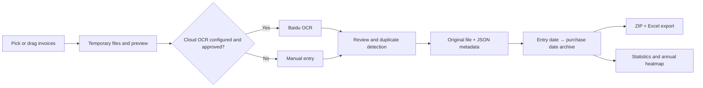

# LabInvoiceSystem

<p align="center">
  <a href="./README.md">简体中文</a> · English
</p>

[](https://github.com/MIGO-OvO/LabInvoiceSystem/releases/latest)
[](https://github.com/MIGO-OvO/LabInvoiceSystem/actions/workflows/release.yml)
[](https://dotnet.microsoft.com/)
[](https://avaloniaui.net/)
[](https://github.com/MIGO-OvO/LabInvoiceSystem/releases)
[](./LICENSE)

> Latest stable release: [LabInvoiceSystem 2.0.0](https://github.com/MIGO-OvO/LabInvoiceSystem/releases/tag/v2.0.0)

## Overview

LabInvoiceSystem is a cross-platform desktop invoice tool for laboratories, research groups, and reimbursement
workflows. It combines file import, Baidu Cloud OCR, manual review, local archiving, reimbursement export,
and spending statistics in one Avalonia application.

Version 2.0.0 introduces a two-level "entry date → purchase date" archive and lets users move an archived
invoice to any entry-date group from the existing edit window. The full workflow also works without cloud OCR:
original files, JSON metadata, and exports remain on the local device.

## Core Features

| Area | Current capability |
| --- | --- |
| Invoice import | Pick or drag PDF, JPG, JPEG, and PNG files; process up to three concurrently |
| OCR and manual entry | Call Baidu VAT Invoice OCR after consent, or complete the workflow entirely by hand |
| PDF preview | Render the first page with wheel zoom, panning, and reset controls |
| Review and validation | Edit dates, amount, item, payment method, invoice number, seller, and tax ID |
| Duplicate detection | Check the current batch and archive, then let the user confirm possible duplicates |
| Two-level archive | Group by entry and purchase date; search, collapse, select, and reassign groups |
| Reimbursement export | Package original invoices and an eight-column Excel detail sheet in one ZIP |
| Dashboard | Show total amount, invoice count, last-30-days amount, and a one-year heatmap |
| Local settings | Persist theme, directories, OCR usage, field corrections, and operation logs |

## Project Status and Metrics

| Metric | Current value |
| --- | --- |
| Stable version | `2.0.0`, released 2026-07-15 |
| Target framework | `.NET 8` / `net8.0` |
| UI framework | Avalonia 11.3.9 with Fluent theme |
| Architecture | MVVM with `CommunityToolkit.Mvvm` |
| Release platforms | Windows, Linux, and macOS on x64 and arm64 |
| Distribution | Self-contained single-file app in ZIP or TAR.GZ |
| Release verification | Six GitHub Actions builds plus `SHA256SUMS.txt` |
| Repository size | 31 C# files, 8 AXAML files, and 9 asset files |
| License | MIT |

## Getting Started

### Download a Release (Installation)

Open [GitHub Releases](https://github.com/MIGO-OvO/LabInvoiceSystem/releases/latest) and select your operating
system and CPU architecture:

| Operating system | x64 | arm64 |
| --- | --- | --- |
| Windows | `LabInvoiceSystem-2.0.0-win-x64.zip` | `LabInvoiceSystem-2.0.0-win-arm64.zip` |
| Linux | `LabInvoiceSystem-2.0.0-linux-x64.tar.gz` | `LabInvoiceSystem-2.0.0-linux-arm64.tar.gz` |
| macOS | `LabInvoiceSystem-2.0.0-osx-x64.tar.gz` | `LabInvoiceSystem-2.0.0-osx-arm64.tar.gz` |

Release packages include the .NET runtime, so end users do not need the .NET SDK.

### Run a Release Package

#### Windows

Extract the ZIP file and run `LabInvoiceSystem.exe`.

#### Linux

```bash
tar -xzf LabInvoiceSystem-2.0.0-linux-x64.tar.gz
chmod +x LabInvoiceSystem
./LabInvoiceSystem
```

#### macOS

```bash
tar -xzf LabInvoiceSystem-2.0.0-osx-arm64.tar.gz
chmod +x LabInvoiceSystem
./LabInvoiceSystem
```

The macOS package is currently unsigned. If the first launch is blocked, allow it from
System Settings → Privacy & Security.

### Verify a Download

Each Release includes `SHA256SUMS.txt`. On Windows:

```powershell
Get-FileHash .\LabInvoiceSystem-2.0.0-win-x64.zip -Algorithm SHA256
```

On Linux or macOS:

```bash
sha256sum LabInvoiceSystem-2.0.0-linux-x64.tar.gz
```

Compare the result with the matching line in `SHA256SUMS.txt`.

### Run From Source

Source development requires the [.NET 8 SDK](https://dotnet.microsoft.com/download/dotnet/8.0).

```bash
git clone https://github.com/MIGO-OvO/LabInvoiceSystem.git
cd LabInvoiceSystem
dotnet restore
dotnet run --project LabInvoiceSystem/LabInvoiceSystem.csproj
```

Windows users can also run `start.bat` from the repository root.

## Usage Workflow

1. Pick or drag invoice files into the Invoice Import workspace.
2. Accept the cloud OCR privacy notice on first use, or choose manual entry.
3. Review the preview and correct the purchase date, amount, item, payment method, invoice number, and seller.
4. Resolve any possible-duplicate warning, then archive one invoice or the complete batch.
5. Browse, search, or edit records in Invoice Export by entry date and purchase date.
6. Select invoices or a date group and export a ZIP containing originals and an Excel detail sheet.
7. Review totals, recent spending, and the annual heatmap on the Dashboard.

## Archive and Export Model

### Two Date Levels

- `EntryDate` is when the invoice entered the system or the archive date chosen by the user. It is the top level.
- `InvoiceDate` is the actual purchase date and forms the second level under an entry date.
- Changing `EntryDate` in the archive editor immediately moves the invoice to the matching entry-date group.

### Files and Metadata

Original files are stored by purchase month under `archive_data/YYYY-MM/`, with same-name JSON metadata:

```text
archive_data/YYYY-MM/YYYYMMDD-item-paymentMethod-amount元.ext
archive_data/YYYY-MM/YYYYMMDD-item-paymentMethod-amount元.json
```

JSON stores the entry date, purchase date, amount, item, payment method, invoice number, seller name, and tax ID.

### ZIP and Excel

An export ZIP contains the selected original invoices and one Excel detail sheet with these columns:

```text
Entry date, purchase date, amount, item name, payment method, invoice number, seller name, seller tax ID
```

For one payment method, ZIP names use `date+paymentMethod.zip`; mixed methods use `date_invoices.zip`.

## OCR, Privacy, and Credentials

Cloud recognition uses Baidu Cloud OAuth and the VAT Invoice OCR endpoint. No API credentials are embedded
in the source code.

- Images are uploaded only after the user explicitly consents to cloud OCR.
- Manual-entry mode does not send invoice images to Baidu Cloud.
- Windows encrypts the Secret Key with current-user DPAPI before persisting it.
- Linux and macOS keep the Secret Key in memory for the current session and do not write it to disk.
- Linux and macOS can read the key from `LABINVOICESYSTEM_BAIDU_SECRET_KEY`.
- Monthly OCR calls are tracked locally; OCR configuration is optional for archiving and export.

## Platform Differences

| Behavior | Windows | Linux / macOS |
| --- | --- | --- |
| Archive deletion | Move to the Recycle Bin and allow recovery | Permanently delete after an explicit warning |
| Secret Key | Persist with DPAPI encryption | Keep for the session or read from an environment variable |
| Reveal export | Select the file in File Explorer | Open the export directory |
| Release format | ZIP | TAR.GZ |

## Data and Configuration

Default runtime directories:

| Setting | Default | Purpose |
| --- | --- | --- |
| `ArchiveDirectory` | `archive_data` | Original invoices and JSON metadata |
| `TempUploadDirectory` | `temp_uploads` | Files waiting to be archived |
| `ExportDirectory` | `export_data` | ZIP and Excel exports |

Settings and operation logs live under the current operating system's user application-data directory:

```text
LabInvoiceSystem/appsettings.json
LabInvoiceSystem/upload_logs.json
```

Do not commit runtime data, real invoices, or OCR credentials.

## Architecture



The main layers are:

- `Views`: Avalonia AXAML pages and small amounts of window interaction code.
- `ViewModels`: page state, commands, validation, and grouping behavior.
- `Services`: OCR, PDF rendering, file archive, settings, statistics, and logging.
- `Models`: invoices, archive items, date groups, statistics, and settings.

## Repository Structure

```text
LabInvoiceSystem/
├── .github/workflows/release.yml      # Six-platform build and GitHub Release
├── LabInvoiceSystem.sln
├── README.md / README.en.md
├── RELEASE_NOTES.md
├── LICENSE
├── start.bat                          # Windows source launcher
└── LabInvoiceSystem/
    ├── Assets/                        # Application icons and resources
    ├── Converters/                    # Avalonia binding converters
    ├── Models/                        # Domain and view state models
    ├── Services/                      # OCR, files, PDF, settings, statistics, logs
    ├── Styles/                        # Theme colors, icons, and control styles
    ├── ViewModels/                    # Import, export, dashboard, and shell logic
    ├── Views/                         # AXAML pages and code-behind
    ├── App.axaml                      # Application resource entry point
    ├── Program.cs                     # Desktop application entry point
    └── LabInvoiceSystem.csproj        # Project, dependencies, and version
```

## Technology Stack

| Dependency | Version | Purpose |
| --- | --- | --- |
| Avalonia / Avalonia.Desktop | 11.3.9 | Cross-platform desktop UI |
| Avalonia Fluent / Inter | 11.3.9 | Theme and fonts |
| CommunityToolkit.Mvvm | 8.2.1 | Observable properties and RelayCommand |
| LiveChartsCore Avalonia | 2.0.0-rc4 | Dashboard charts |
| MiniExcel | 1.42.0 | Excel detail export |
| PDFtoImage | 4.1.0 | First-page PDF rendering |
| SkiaSharp | 2.88.9 | Image processing |
| Svg.Controls.Skia.Avalonia | 11.3.6.2 | SVG rendering |

## Build and Release

Example local Release build:

```bash
dotnet publish LabInvoiceSystem/LabInvoiceSystem.csproj \
  -c Release -r win-x64 --self-contained true \
  -p:PublishSingleFile=true \
  -p:IncludeNativeLibrariesForSelfExtract=true
```

Supported RIDs: `win-x64`, `win-arm64`, `linux-x64`, `linux-arm64`, `osx-x64`, and `osx-arm64`.

The [release workflow](./.github/workflows/release.yml) validates all six targets on pull requests. A `v*` tag
rebuilds and packages them, writes SHA-256 checksums, and creates the GitHub Release.

## Known Limitations

- Cloud OCR requires a Baidu Cloud account, valid credentials, and network access.
- PDF preview and OCR process only the first page; multi-page invoices should place the invoice on page one.
- macOS packages are not yet code-signed or notarized.
- The repository has no separate automated test project; CI verifies compilation and packaging on six targets.

## FAQ

### Can I archive an invoice after OCR fails?

Yes. The invoice remains available for review, and you can enter the required fields manually before archiving.

### Why does my Secret Key disappear after restarting on Linux or macOS?

This is the current security policy: non-Windows platforms do not write the Secret Key to the settings file.
Set `LABINVOICESYSTEM_BAIDU_SECRET_KEY` when persistent availability is required.

### Why is the Dashboard empty?

The Dashboard reads archived invoices only. Archive at least one invoice, then refresh the Dashboard.

### Where are exports saved?

The default is `export_data`. Use Invoice Export to choose another directory or open the current one.

## Contributing

Issues and pull requests are welcome. Before submitting a change:

1. Keep the existing MVVM layering and naming style.
2. Do not commit real invoices, OCR credentials, `archive_data`, `temp_uploads`, `bin`, or `obj`.
3. Run `dotnet build LabInvoiceSystem/LabInvoiceSystem.csproj -c Release` at minimum.
4. For release changes, verify that the six-platform matrix succeeds.

## Reporting Issues and Contact

Use [GitHub Issues](https://github.com/MIGO-OvO/LabInvoiceSystem/issues) for bugs and feature requests,
or contact the repository maintainer [@MIGO-OvO](https://github.com/MIGO-OvO).

Include reproduction steps, expected and actual behavior, operating system, CPU architecture, file type,
and relevant logs when possible.

## License

LabInvoiceSystem is available under the [MIT License](./LICENSE). You may use, copy, modify, merge, publish,
distribute, sublicense, or sell copies while preserving the license and copyright notice.

## Acknowledgements

- [Avalonia UI](https://avaloniaui.net/)
- [CommunityToolkit.Mvvm](https://learn.microsoft.com/dotnet/communitytoolkit/mvvm/)
- [LiveChartsCore](https://github.com/beto-rodriguez/LiveCharts2)
- [MiniExcel](https://github.com/mini-software/MiniExcel)
- [PDFtoImage](https://github.com/sungaila/PDFtoImage)
- [SkiaSharp](https://github.com/mono/SkiaSharp)
- [Baidu Cloud OCR](https://cloud.baidu.com/product/ocr)
