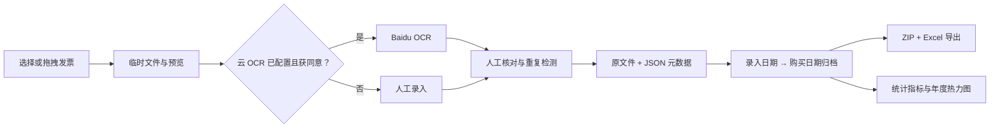

# LabInvoiceSystem

<p align="center">
  简体中文 · <a href="./README.en.md">English</a>
</p>

[](https://github.com/MIGO-OvO/LabInvoiceSystem/releases/latest)
[](https://github.com/MIGO-OvO/LabInvoiceSystem/actions/workflows/release.yml)
[](https://dotnet.microsoft.com/)
[](https://avaloniaui.net/)
[](https://github.com/MIGO-OvO/LabInvoiceSystem/releases)
[](./LICENSE)

> 最新正式版：[LabInvoiceSystem 2.0.0](https://github.com/MIGO-OvO/LabInvoiceSystem/releases/tag/v2.0.0)

## 项目概览 (Overview)

LabInvoiceSystem 是面向实验室、课题组和科研报销场景的跨平台桌面发票工具。它将发票上传、
百度云 OCR、人工核对、本地归档、报账导出和支出统计整合到一个 Avalonia 应用中。

2.0.0 引入“录入日期 → 购买日期”两级归档结构，并允许在编辑窗口中将发票调整到任意录入日期组。
应用可在不启用云 OCR 的情况下完成纯本机手工录入；归档原文件、JSON 元数据和导出文件始终保存在本机。

## 核心能力

| 模块 | 当前能力 |
| --- | --- |
| 发票录入 | 文件选择或拖拽导入 PDF、JPG、JPEG、PNG；最多并行处理 3 个文件 |
| OCR 与人工录入 | 明确同意后调用百度增值税发票 OCR；未配置或拒绝云 OCR 时可手工录入 |
| PDF 预览 | 渲染 PDF 首页，支持滚轮缩放、拖动和平移复位 |
| 核对与校验 | 编辑购买日期、金额、项目、支付方式、发票号、销售方和税号 |
| 重复检测 | 归档前检查当前批次和历史归档中的疑似重复发票，支持人工确认 |
| 两级归档 | 按录入日期和购买日期分组，可搜索、折叠、批量选择和手动调整日期组 |
| 报账导出 | 导出选中发票原文件，并在 ZIP 中附带 8 字段 Excel 明细 |
| 统计仪表盘 | 显示累计金额、发票数量、近 30 天金额和过去一年支出热力图 |
| 本机配置 | 保存主题、目录、OCR 用量、字段纠正记录和操作日志 |

## 当前状态

| 指标 | 当前值 |
| --- | --- |
| 正式版本 | `2.0.0`，发布于 2026-07-15 |
| 目标框架 | `.NET 8` / `net8.0` |
| UI 框架 | Avalonia 11.3.9，Fluent 主题 |
| 架构 | MVVM，`CommunityToolkit.Mvvm` |
| 发布平台 | Windows、Linux、macOS 的 x64 与 arm64 |
| 发布方式 | 自包含单文件应用，压缩为 ZIP 或 TAR.GZ |
| 发布校验 | 6 平台 GitHub Actions 构建 + `SHA256SUMS.txt` |
| 项目规模 | 31 个 C# 文件、8 个 AXAML 文件、9 个资源文件 |
| 许可证 | MIT |

## 快速开始 (Getting Started)

### 下载发布版 (Installation)

前往 [GitHub Releases](https://github.com/MIGO-OvO/LabInvoiceSystem/releases/latest)，按系统和处理器架构下载：

| 系统 | x64 | arm64 |
| --- | --- | --- |
| Windows | `LabInvoiceSystem-2.0.0-win-x64.zip` | `LabInvoiceSystem-2.0.0-win-arm64.zip` |
| Linux | `LabInvoiceSystem-2.0.0-linux-x64.tar.gz` | `LabInvoiceSystem-2.0.0-linux-arm64.tar.gz` |
| macOS | `LabInvoiceSystem-2.0.0-osx-x64.tar.gz` | `LabInvoiceSystem-2.0.0-osx-arm64.tar.gz` |

这些发布包已包含 .NET 运行时，普通用户无需另外安装 .NET SDK。

### 运行发布包

#### Windows

解压 ZIP 后运行 `LabInvoiceSystem.exe`。

#### Linux

```bash
tar -xzf LabInvoiceSystem-2.0.0-linux-x64.tar.gz
chmod +x LabInvoiceSystem
./LabInvoiceSystem
```

#### macOS

```bash
tar -xzf LabInvoiceSystem-2.0.0-osx-arm64.tar.gz
chmod +x LabInvoiceSystem
./LabInvoiceSystem
```

macOS 包目前未签名。若系统阻止首次启动，请在“系统设置 → 隐私与安全性”中确认打开。

### 校验下载文件

Release 同时提供 `SHA256SUMS.txt`。在 Windows 上可运行：

```powershell
Get-FileHash .\LabInvoiceSystem-2.0.0-win-x64.zip -Algorithm SHA256
```

在 Linux 或 macOS 上可运行：

```bash
sha256sum LabInvoiceSystem-2.0.0-linux-x64.tar.gz
```

将输出与 `SHA256SUMS.txt` 中对应条目比较。

### 从源码运行

源码开发需要 [.NET 8 SDK](https://dotnet.microsoft.com/download/dotnet/8.0)。

```bash
git clone https://github.com/MIGO-OvO/LabInvoiceSystem.git
cd LabInvoiceSystem
dotnet restore
dotnet run --project LabInvoiceSystem/LabInvoiceSystem.csproj
```

Windows 也可以运行根目录的 `start.bat`。

## 使用流程 (Usage)

1. 在“发票录入”中选择或拖入发票文件。
2. 首次使用云 OCR 时确认隐私提示；也可以选择“仅手工录入”。
3. 在右侧预览并核对购买日期、金额、项目、支付方式、发票号和销售方信息。
4. 处理可能出现的重复发票警告，然后单张归档或批量归档。
5. 在“发票导出”中按录入日期和购买日期浏览、搜索或编辑归档记录。
6. 选择发票或日期组，导出包含原文件和 Excel 明细的 ZIP。
7. 在“仪表盘”中查看累计数据、近 30 天支出和年度热力图。

## 归档与导出

### 两级日期模型

- `EntryDate`：发票进入系统或用户指定的归档组日期，是导出页的大层级。
- `InvoiceDate`：实际购买日期，是录入日期下的次级分组。
- 编辑已归档发票的 `EntryDate` 后，列表会立即将它归入新的录入日期组。

### 文件与元数据

原文件按购买月份保存在 `archive_data/YYYY-MM/`，并写入同名 JSON 元数据：

```text
archive_data/YYYY-MM/YYYYMMDD-项目名称-支付方式-金额元.ext
archive_data/YYYY-MM/YYYYMMDD-项目名称-支付方式-金额元.json
```

JSON 保存录入日期、购买日期、金额、项目、支付方式、发票号码、销售方名称和销售方税号。

### ZIP 与 Excel

导出的 ZIP 包含所选发票原文件和一份 Excel 明细。Excel 字段为：

```text
发票录入日期、购买日期、金额、项目名称、支付方式、发票号码、销售方名称、销售方税号
```

单一支付方式的 ZIP 默认命名为 `日期+支付方式.zip`，混合支付方式使用 `日期_发票.zip`。

## OCR、隐私与密钥

云 OCR 使用百度智能云 OAuth 和增值税发票识别接口。源码不包含默认 API Key 或 Secret Key。

- 应用只在用户明确同意后上传识别所需的发票图像。
- 选择“仅手工录入”时不会将图像发送到百度云。
- Windows 使用当前用户范围的 DPAPI 加密保存 Secret Key。
- Linux 和 macOS 默认只在当前会话保留 Secret Key，不写入磁盘。
- Linux 和 macOS 可通过 `LABINVOICESYSTEM_BAIDU_SECRET_KEY` 环境变量提供 Secret Key。
- OCR 调用次数按月记录；未配置 OCR 时不影响手工归档和导出。

## 平台差异

| 行为 | Windows | Linux / macOS |
| --- | --- | --- |
| 删除归档文件 | 移到系统回收站，可恢复 | 永久删除，确认窗口会明确提示 |
| Secret Key | DPAPI 加密持久化 | 会话内保存，或使用环境变量 |
| 导出后定位 | 在资源管理器中选中文件 | 打开导出目录 |
| 发布格式 | ZIP | TAR.GZ |

## 数据与配置目录

默认运行目录：

| 配置项 | 默认值 | 用途 |
| --- | --- | --- |
| `ArchiveDirectory` | `archive_data` | 发票原文件与 JSON 元数据 |
| `TempUploadDirectory` | `temp_uploads` | 尚未归档的临时文件 |
| `ExportDirectory` | `export_data` | ZIP 和 Excel 导出结果 |

应用设置和操作日志位于当前系统的用户应用数据目录：

```text
LabInvoiceSystem/appsettings.json
LabInvoiceSystem/upload_logs.json
```

请勿提交这些运行数据、真实发票或 OCR 密钥。

## 架构概览



主要分层：

- `Views`：Avalonia AXAML 页面和少量窗口交互代码。
- `ViewModels`：页面状态、命令、校验和分组逻辑。
- `Services`：OCR、PDF 渲染、文件归档、设置、统计和日志。
- `Models`：发票、归档项、日期组、统计和配置模型。

## 目录结构

```text
LabInvoiceSystem/
├── .github/workflows/release.yml      # 六平台构建与 GitHub Release
├── LabInvoiceSystem.sln
├── README.md / README.en.md
├── RELEASE_NOTES.md
├── LICENSE
├── start.bat                          # Windows 源码启动脚本
└── LabInvoiceSystem/
    ├── Assets/                        # 应用图标和资源
    ├── Converters/                    # Avalonia 绑定转换器
    ├── Models/                        # 领域与界面模型
    ├── Services/                      # OCR、文件、PDF、配置、统计、日志
    ├── Styles/                        # 主题颜色、图标和控件样式
    ├── ViewModels/                    # 录入、导出、仪表盘和主窗口逻辑
    ├── Views/                         # AXAML 页面及代码后置
    ├── App.axaml                      # 应用资源入口
    ├── Program.cs                     # 桌面应用入口
    └── LabInvoiceSystem.csproj        # .NET 项目与版本配置
```

## 技术栈

| 依赖 | 版本 | 用途 |
| --- | --- | --- |
| Avalonia / Avalonia.Desktop | 11.3.9 | 跨平台桌面 UI |
| Avalonia Fluent / Inter | 11.3.9 | 主题与字体 |
| CommunityToolkit.Mvvm | 8.2.1 | Observable 属性与 RelayCommand |
| LiveChartsCore Avalonia | 2.0.0-rc4 | 仪表盘图表 |
| MiniExcel | 1.42.0 | Excel 明细导出 |
| PDFtoImage | 4.1.0 | PDF 首页渲染 |
| SkiaSharp | 2.88.9 | 图像处理 |
| Svg.Controls.Skia.Avalonia | 11.3.6.2 | SVG 资源显示 |

## 构建与发布

本地 Release 构建示例：

```bash
dotnet publish LabInvoiceSystem/LabInvoiceSystem.csproj \
  -c Release -r win-x64 --self-contained true \
  -p:PublishSingleFile=true \
  -p:IncludeNativeLibrariesForSelfExtract=true
```

可用 RID：`win-x64`、`win-arm64`、`linux-x64`、`linux-arm64`、`osx-x64`、`osx-arm64`。

[发布工作流](./.github/workflows/release.yml) 会在 PR 中验证六个平台；推送 `v*` 标签后，它会重新构建、
压缩产物、生成 SHA-256 校验文件并创建 GitHub Release。

## 已知限制

- 云 OCR 依赖百度智能云账户、有效凭据和网络连接。
- PDF 预览与 OCR 仅处理第一页；多页发票应确保目标内容位于首页。
- macOS 发布包尚未签名或公证。
- 当前仓库没有独立的自动化测试项目，CI 负责六平台编译与打包验证。

## 常见问题

### OCR 失败后还能归档吗？

可以。发票会保留在待核对状态，可手工补全必填字段后归档。

### 为什么重新启动后 Linux/macOS 的 Secret Key 消失？

这是当前的安全策略：非 Windows 平台不会将 Secret Key 写入配置文件。需要持久使用时，请设置
`LABINVOICESYSTEM_BAIDU_SECRET_KEY` 环境变量。

### 仪表盘为什么没有数据？

仪表盘只统计已归档发票。请先完成归档，再进入仪表盘刷新数据。

### 导出文件在哪里？

默认位于 `export_data`。可在“发票导出”页面修改导出目录并直接打开该目录。

## 贡献 (Contributing)

欢迎提交 Issue 或 Pull Request。提交前请：

1. 保持现有 MVVM 分层和命名方式。
2. 不提交真实发票、OCR 密钥、`archive_data`、`temp_uploads`、`bin` 或 `obj`。
3. 至少运行 `dotnet build LabInvoiceSystem/LabInvoiceSystem.csproj -c Release`。
4. 涉及发布逻辑时，确认六个平台矩阵能够通过。

## 问题反馈与联系 (Issues / Contact)

请通过 [GitHub Issues](https://github.com/MIGO-OvO/LabInvoiceSystem/issues) 报告缺陷或提出建议，
也可以联系仓库维护者 [@MIGO-OvO](https://github.com/MIGO-OvO)。

问题报告建议包含复现步骤、期望结果、实际结果、操作系统、处理器架构、文件类型和相关日志。

## 许可证 (License)

本项目使用 [MIT License](./LICENSE)。你可以在保留许可证与版权声明的前提下使用、复制、修改、
合并、发布、分发、再授权或销售本项目副本。

## 致谢 (Acknowledgements)

- [Avalonia UI](https://avaloniaui.net/)
- [CommunityToolkit.Mvvm](https://learn.microsoft.com/dotnet/communitytoolkit/mvvm/)
- [LiveChartsCore](https://github.com/beto-rodriguez/LiveCharts2)
- [MiniExcel](https://github.com/mini-software/MiniExcel)
- [PDFtoImage](https://github.com/sungaila/PDFtoImage)
- [SkiaSharp](https://github.com/mono/SkiaSharp)
- [百度智能云 OCR](https://cloud.baidu.com/product/ocr)
