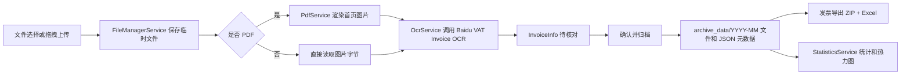

# LabInvoiceSystem

<p align="center">
  
</p>

<p align="center">
  <a href="./README.en.md">English</a> | 简体中文
</p>

[](https://dotnet.microsoft.com/)
[](https://avaloniaui.net/)
[](https://learn.microsoft.com/dotnet/architecture/maui/mvvm)
[](https://www.microsoft.com/windows)
[](https://cloud.baidu.com/product/ocr)
[](./LICENSE)

## 项目概览 (Overview)

LabInvoiceSystem 是一个面向实验室、课题组和科研报销场景的桌面发票管理工具。它用
Avalonia 构建跨平台 UI，用 .NET 8 承载业务逻辑，围绕“上传发票、OCR 识别、人工核对、
归档、按日报账导出、统计分析”这条流程减少手工整理发票的重复工作。

当前项目主要面向 Windows 桌面环境使用。Avalonia 本身具备跨平台能力，但仓库中的启动脚本、
发布配置、资源路径和文件打开行为都优先服务 Windows。

## 核心功能

| 模块 | 能力 |
| --- | --- |
| 发票录入 | 支持通过文件选择器或拖拽上传 PDF、JPG、JPEG、PNG 发票文件 |
| PDF 预览 | 使用 `PDFtoImage` 和 `SkiaSharp` 将 PDF 首页渲染为图片，预览区支持缩放、拖动、双击重置 |
| OCR 识别 | 调用百度增值税发票 OCR 接口，提取日期、金额、项目、发票号码、销售方名称和税号 |
| 人工核对 | OCR 后进入待核对状态，可在界面中修正日期、金额、项目名称和支付方式 |
| 本地归档 | 按 `YYYY-MM` 分目录保存发票原文件，并为每张发票写入同名 JSON 元数据 |
| 导出报账 | 按日期分组导出 ZIP，同时生成 Excel 明细表并打包到 ZIP 中 |
| 统计仪表盘 | 展示累计金额、累计发票数量、近 30 天金额和过去一年报账热力图 |
| API 管理 | 在仪表盘中配置、测试并保存 Baidu OCR API Key 和 Secret Key |
| 操作日志 | 将上传、归档、删除、导出等关键动作写入用户目录下的 JSON 日志 |

## 项目状态

| 指标 | 当前值 |
| --- | --- |
| 应用类型 | 桌面端发票 OCR、归档和导出工具 |
| 目标框架 | `net8.0` |
| UI 框架 | Avalonia 11.3.9, Fluent theme |
| 架构模式 | MVVM, `CommunityToolkit.Mvvm` |
| 主要工作区 | 发票录入、发票导出、仪表盘 |
| C# 源文件 | 31 |
| AXAML 文件 | 8 |
| 图标资源 | 8 |
| 默认发布目标 | `win-x64`, self-contained, single file |

## 快速开始 (Getting Started)

### 环境要求

- Windows 10 或更高版本。
- [.NET 8 SDK](https://dotnet.microsoft.com/download/dotnet/8.0)，用于从源码运行、调试和发布。
- 百度智能云 OCR 应用的 `API Key` 和 `Secret Key`，用于真实发票识别。

### 安装与运行 (Installation)

```bash
git clone https://github.com/MIGO-OvO/LabInvoiceSystem.git
cd LabInvoiceSystem
```

### 从源码运行

```bash
dotnet restore
dotnet run --project LabInvoiceSystem/LabInvoiceSystem.csproj
```

也可以在 Windows 上直接运行根目录脚本：

```bat
start.bat
```

### 发布 Windows 单文件版本

```bash
dotnet publish LabInvoiceSystem/LabInvoiceSystem.csproj ^
  -c Release ^
  -r win-x64 ^
  --self-contained true ^
  /p:PublishSingleFile=true
```

仓库内的发布配置文件位于
[发布配置](./LabInvoiceSystem/Properties/PublishProfiles/FolderProfile.pubxml)。

## 使用流程 (Usage)

1. 打开应用后进入“发票录入”。
2. 点击“上传文件”或将发票文件拖入左侧区域。
3. PDF 会先转换成图片，图片文件会直接进入 OCR 流程。
4. OCR 完成后，在右侧预览区核对发票图片和识别字段。
5. 修正日期、金额、项目名称和支付方式。
6. 点击“确认并归档”，或使用“全部归档”批量处理。
7. 进入“发票导出”，按日期查看归档记录，导出 ZIP 或删除归档文件。
8. 进入“仪表盘”，查看累计金额、发票数量、近 30 天金额和年度热力图。

## OCR 配置

OCR 调用由 [OcrService.cs](./LabInvoiceSystem/Services/OcrService.cs) 负责。应用使用百度
OAuth 接口获取 `access_token`，再调用增值税发票 OCR 接口。

配置入口在“仪表盘”的“配置百度 API”按钮中：

1. 填入百度 OCR 的 `API Key` 和 `Secret Key`。
2. 点击“测试连接”，验证能否获取访问令牌。
3. 点击“保存配置”，配置会写入用户目录。

请不要将生产环境 OCR 密钥提交到仓库。当前运行配置保存在：

```text
%APPDATA%\LabInvoiceSystem\appsettings.json
```

应用还会在同一目录记录操作日志：

```text
%APPDATA%\LabInvoiceSystem\upload_logs.json
```

## 文件归档规则

默认目录来自 `AppSettings`：

| 配置项 | 默认值 | 说明 |
| --- | --- | --- |
| `ArchiveDirectory` | `archive_data` | 已归档发票根目录 |
| `TempUploadDirectory` | `temp_uploads` | 上传后、归档前的临时目录 |
| `ExportDirectory` | `export_data` | ZIP 和 Excel 导出目录 |

发票归档时会写入：

```text
archive_data/YYYY-MM/YYYYMMDD-项目名称-支付方式-金额元.ext
archive_data/YYYY-MM/YYYYMMDD-项目名称-支付方式-金额元.json
```

JSON 元数据用于比单纯解析文件名更可靠地恢复发票日期、金额、项目、支付方式、发票号码、
销售方名称和销售方税号。

## 架构概览



## 目录结构

```text
LabInvoiceSystem/
|-- README.md
|-- README.en.md
|-- LabInvoiceSystem.sln
|-- start.bat
|-- archive_data/                         # 默认归档目录，运行时数据
`-- LabInvoiceSystem/
    |-- App.axaml                         # Avalonia 应用样式、资源和 ViewLocator
    |-- Program.cs                        # 桌面应用入口
    |-- Assets/                           # ICO、SVG、PNG 图标资源
    |-- Models/                           # InvoiceInfo、ArchiveItem、StatisticsData、AppSettings
    |-- ViewModels/                       # MainWindow、导入、导出、统计页面状态和命令
    |-- Views/                            # AXAML 页面和窗口
    |-- Services/                         # OCR、PDF、文件、设置、统计、日志服务
    |-- Styles/                           # 图标、主题色和通用控件样式
    |-- Converters/                       # UI 绑定转换器
    `-- Properties/PublishProfiles/        # Windows 发布配置
```

## 技术栈

| 依赖 | 用途 |
| --- | --- |
| `Avalonia`, `Avalonia.Desktop` | 桌面 UI 框架 |
| `Avalonia.Themes.Fluent`, `Avalonia.Fonts.Inter` | Fluent 风格和字体 |
| `CommunityToolkit.Mvvm` | Observable 属性、RelayCommand 和 MVVM 支持 |
| `Avalonia.Controls.DataGrid` | 归档发票表格展示 |
| `LiveChartsCore.SkiaSharpView.Avalonia` | 图表与统计可视化 |
| `MiniExcel` | 导出 Excel 明细 |
| `PDFtoImage` | PDF 首页转图片 |
| `SkiaSharp` | 图像渲染和处理 |
| `Svg.Controls.Skia.Avalonia` | SVG 资源渲染 |

## 开发说明

- 默认页面由 [MainWindowViewModel.cs](./LabInvoiceSystem/ViewModels/MainWindowViewModel.cs) 控制。
- View 和 ViewModel 通过 [ViewLocator.cs](./LabInvoiceSystem/ViewLocator.cs) 关联。
- 主题切换会写入 `AppSettings.ThemeMode`。
- 导出 ZIP 时，单一支付方式使用 `YYYYMMDD+支付方式.zip`，混合支付方式使用 `YYYYMMDD_发票.zip`。
- 本仓库当前没有自动化测试项目。修改业务逻辑后，至少运行 `dotnet build` 做基础验证。

## 常见问题

### OCR 识别失败怎么办？

检查网络是否能访问百度智能云，确认 API Key 和 Secret Key 是否有效，并查看界面中的错误提示。
如果 OCR 失败，发票仍会进入待核对状态，可以手工补全金额和项目后归档。

### PDF 无法预览或识别怎么办？

确认文件是真实 PDF，文件头应为 `%PDF-`，且文件不为空、未损坏。应用只渲染首页用于预览和 OCR，
多页 PDF 需要确认发票是否在第一页。

### 仪表盘没有数据怎么办？

仪表盘读取的是已归档文件。请先在“发票录入”中完成“确认并归档”，再进入仪表盘点击“刷新数据”。

### 导出的 ZIP 在哪里？

默认导出到 `export_data`。也可以在“发票导出”页面点击“设置导出路径”，选择新的导出目录。

## 贡献 (Contributing)

当前仓库没有单独的贡献指南。提交改动前，请优先保持现有 MVVM 分层，避免提交本地运行数据、
OCR 密钥、`bin` 或 `obj` 生成物，并至少执行项目构建验证。

## 反馈问题与联系 (Issues / Contact)

请通过 GitHub Issues 反馈缺陷、改进建议或使用问题：

[https://github.com/MIGO-OvO/LabInvoiceSystem/issues](https://github.com/MIGO-OvO/LabInvoiceSystem/issues)

反馈时建议包含操作步骤、期望结果、实际结果、系统版本、发票文件类型以及错误截图或日志。

## 许可证 (License)

本项目使用 [MIT License](./LICENSE) 开源。你可以在遵守 MIT 许可证条款的前提下自由使用、
复制、修改、合并、发布、分发、再授权和销售本项目副本。

## 致谢 (Acknowledgements)

本项目使用以下开源项目和服务构建：

- [Avalonia UI](https://avaloniaui.net/)
- [CommunityToolkit.Mvvm](https://learn.microsoft.com/dotnet/communitytoolkit/mvvm/)
- [LiveChartsCore](https://github.com/beto-rodriguez/LiveCharts2)
- [MiniExcel](https://github.com/mini-software/MiniExcel)
- [PDFtoImage](https://github.com/sungaila/PDFtoImage)
- [SkiaSharp](https://github.com/mono/SkiaSharp)
- [百度智能云 OCR](https://cloud.baidu.com/product/ocr)
